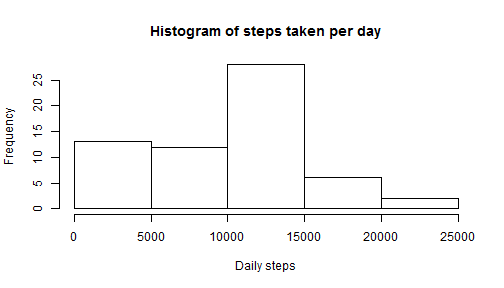
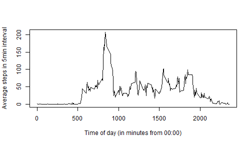
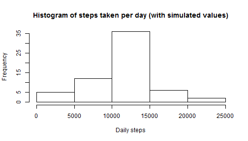
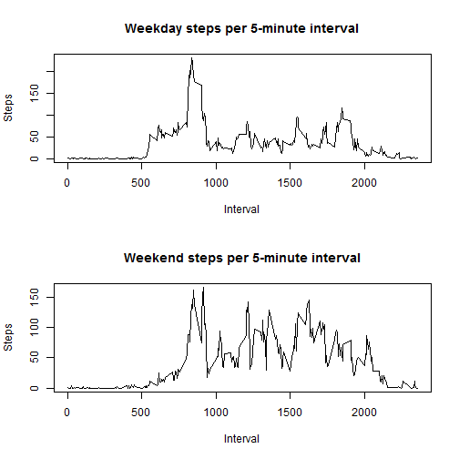

##Loading and preprocessing the data

Let's start by loading the data.


```r
data <- read.csv('activity.csv')
```


Next, let's transform the date collumn from class factor to class date.


```r
data$date <- as.Date(data$date, format = '%Y-%m-%d')
```


##What is the total number of steps taken per day?

We now calculate the sum of steps taken per day.


```r
sumSteps <- tapply(data$steps, data$date, sum, na.rm = TRUE)
```


Below is a histogram of the steps taken per day.


```r
hist(sumSteps, 
     main = 'Histogram of steps taken per day', 
     xlab = 'Daily steps')
```

 


The mean and median of steps taken per day are calculated below.


```r
mean(sumSteps)
```

```
## [1] 9354.23
```

```r
median(sumSteps)
```

```
## [1] 10395
```

##What is the average daily activity pattern?

We now calculate the average number of steps per interval.


```r
intSteps <- tapply(data$steps, data$interval, mean, na.rm = TRUE)
```

We create a time series plot of the 5-minutes intervals against the average steps taken during each interval.


```r
plot(data$interval[1:288], intSteps,
     type = 'l',
     xlab = 'Time of day (in minutes from 00:00)',
     ylab = 'Average steps in 5min interval')
```

 


We now determine the interval with the highest average steps. The index number for the interval is obtained using the which() -function. The index is then used to extract the value of the interval (how many minutes from start of day), which was stored as an attribute by the tapply() -function earlier.


```r
maxInterval <- which(intSteps == max(intSteps))
attr(maxInterval, 'names')
```

```
## [1] "835"
```


##Inputing missing values

First, let's calculate how many missing values there are in the data set.


```r
sum(is.na(data$steps))
```

```
## [1] 2304
```

Let's make a vector called steps2. We then use a loop function to simulate values for steps taken, whereby every missing value is replaced by the average amount of steps in its 5-minute interval.


```r
steps2 <- data$steps
for(i in 1:length(steps2)){
        if(is.na(steps2[i]) == TRUE){
                steps2[i] <- mean(data$steps
                                       [data$interval == data$interval[i]],
                                 na.rm = TRUE)
        }
}
```


Now, a new data frame is created using the vector created above and the date and interval collumns from the original data frame.


```r
data2 <- as.data.frame(steps2)
data2$date <- data$date
data2$interval <- data$interval
names(data2) <- c('steps', 'date', 'interval')
```


A histogram is now plotted to show steps taken per day with the new data. By comparing this new histogram to the previous one, we notice a particularly large increase in the middle range of steps per day.


```r
sumSteps2 <- tapply(data2$steps, data2$date, sum)
hist(sumSteps2,
     main = 'Histogram of steps taken per day (with simulated values)',
     xlab = 'Daily steps')
```

 


We then calculate the mean and median of steps per day using the new data. These new values are higher than those calculated previously, which is understandable, as we have added positive (above zero) observations to the daily steps.


```r
mean(sumSteps2)
```

```
## [1] 10766.19
```

```r
median(sumSteps2)
```

```
## [1] 10766.19
```


##Are there differences in activity patterns between weekdays and weekends?

Here we create a new collumn into the data frame with the filled-in data. The collumn will then be edited to consist of values 'weekday' and 'weekend', which we obtain by using the weekdays() -function and a for loop for assigning the desired values.


```r
data2$day <- weekdays(data2$date)
for(i in 1:length(data2$day)){
        if(data2$day[i] == 'Saturday' | data2$day[i] == 'Sunday'){
                data2$day[i] <- 'Weekend'
        }
                else{data2$day[i] <- 'Weekday'
        }
}
```

Finally, we make a panel plot of the 5-minute interval against average steps taken, where weekdays and weekends are plotted separately.


```r
wdSteps <- tapply(data2$steps[data2$day == 'Weekday'], 
                  data2$interval[data2$day == 'Weekday'],
                  mean)
weSteps <- tapply(data2$steps[data2$day == 'Weekend'], 
                  data2$interval[data2$day == 'Weekend'],
                  mean)

par(mfcol = c(2,1))
    plot(data2$interval[1:288], wdSteps,
         type = 'l',
         main = 'Weekday steps per 5-minute interval',
         xlab = 'Interval',
         ylab = 'Steps')
    
    plot(data2$interval[1:288], weSteps,
         type = 'l',
         main = 'Weekend steps per 5-minute interval',
         xlab = 'Interval',
         ylab = 'Steps')
```

 
